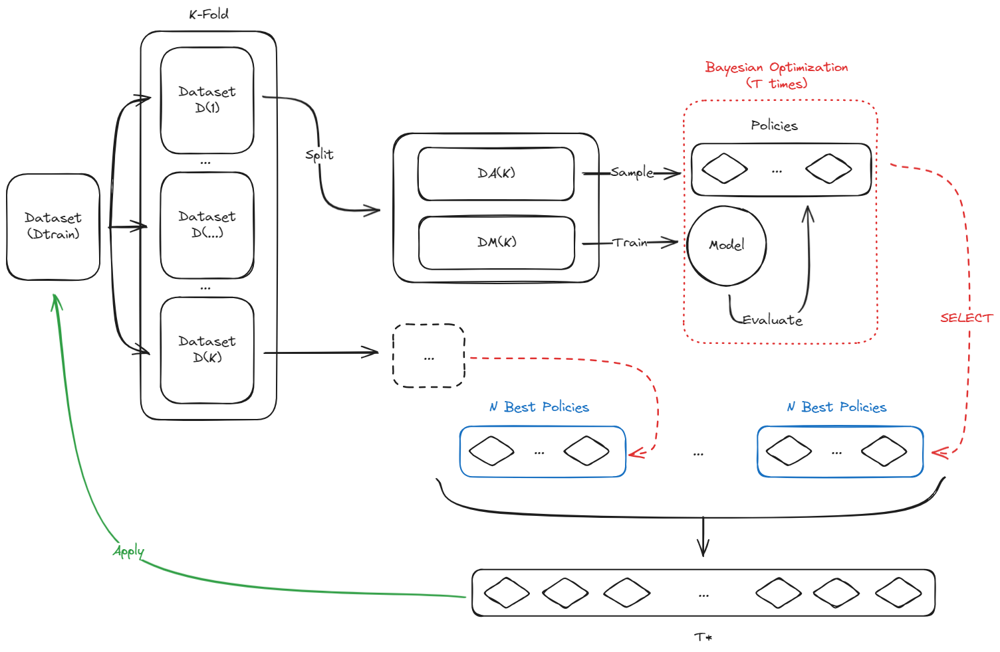

# FastAutoAugment Time Series

This is an unofficial implementation of the paper [Fast AutoAugment](https://arxiv.org/abs/1905.00397) for time series data. The original paper is for image data. The code is inspired from the official implementation of the paper [Fast AutoAugment](https://github.com/kakaobrain/fast-autoaugment).

## Dataset and Model

The dataset used is the [UCR Time Series Classification Archive](https://www.cs.ucr.edu/~eamonn/time_series_data_2018/). The model used  is a ResNet model. 

## Architecture

The architecture of the augmented model is as follows:



## Transformations

The transformations used are as follows:

- Identity
- Additive Noise
- Random Crop
- Drift 
- Reverse


## Requirements

- Python 3.12

# Usage

### Prepare the environment
> I personally recommend using [uv](https://github.com/astral-sh/uv) as package manager. You can install it using the following command:
```bash
pip install uv
```
You can then create the environment and install the dependencies using the following commands:

```bash
uv venv
```
```bash
. venv/bin/activate
```

```bash
uv pip install -r requirements.txt
```

Finally, you can run the code using the following command:

```python
python FastAA/main.py
```
