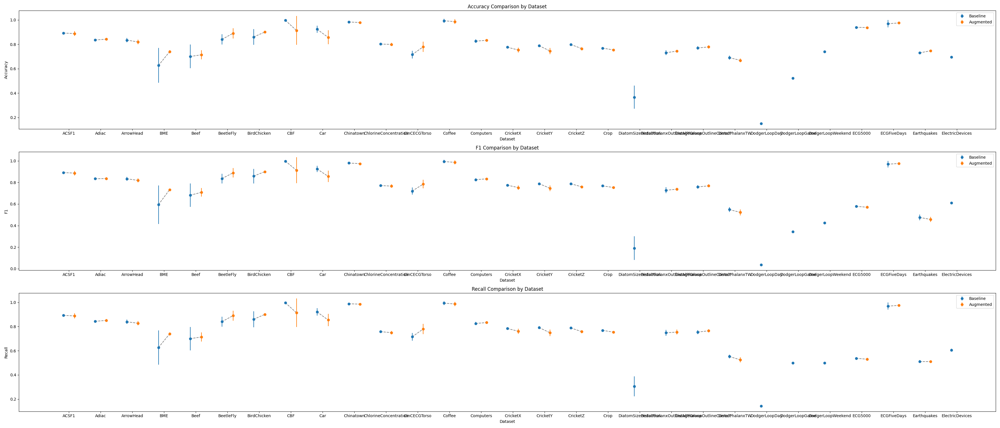

# FastAutoAugment Time Series
> Author: [Matthieu OLEKHNOVITCH](https://Github.com/Matt-Olek)

This is an unofficial implementation of the paper [Fast AutoAugment](https://arxiv.org/abs/1905.00397) for time series data. The original paper is for image data. The code is inspired from the official implementation of the paper [Fast AutoAugment](https://github.com/kakaobrain/fast-autoaugment).

## ⚀ Dataset and Model

The dataset used is the [UCR Time Series Classification Archive](https://www.cs.ucr.edu/~eamonn/time_series_data_2018/). The model used  is a ResNet model. 

## ⚁ Architecture

The architecture of the augmented model is as follows:


## ⚂ Transformations

The transformations used are as follows:

- Identity
- Additive Noise
- Random Crop
- Drift 
- Reverse


## ⚃ Requirements

- Python 3.12

# ⛓ Usage

### Prepare the environment
> I personally recommend using [uv](https://github.com/astral-sh/uv) as package manager. You can install it using the following command:
```bash
pip install uv
```
You can then create the environment and install the dependencies using the following commands:

```bash
uv venv
```
```bash
. venv/bin/activate
```

```bash
uv pip install -r requirements.txt
```

### Configure your cuda device and WnB link in the config file 'FastAA/config.py'

Set the device to 'cuda' or 'cpu' if you want to override automatic device detection. 
Set *is_wandb* to True if you want to log the results to WnB. You may have to log in to WnB using the following command:
```bash
wandb login
```

### Basic run of augmentation on single dataset

You can run FastAA augmentation comparison using the following command:

```python
python FastAA/main.py --dataset=ECG200 --compare --runs=5
```

Other parameters are detailed in the help:
    
```python
python FastAA/main.py --help
```

### Run augmentation on all datasets

You can run FastAA augmentation on all datasets using the following command:

```python
python FastAA/run_full_datasets_exploration.py
```

> Note: This will take a long time to run. You can run it in the background using the following command:
```bash
nohup python FastAA/run_full_datasets_exploration.py &
```

The results will be saved in the data/logs folder as soon as they are computed.

### Plot the metrics comparison between FastAA and baseline

Plot the metrics comparison with the command:

```python
python results/plot_result_table.py 
```

And access the last computed results : 


